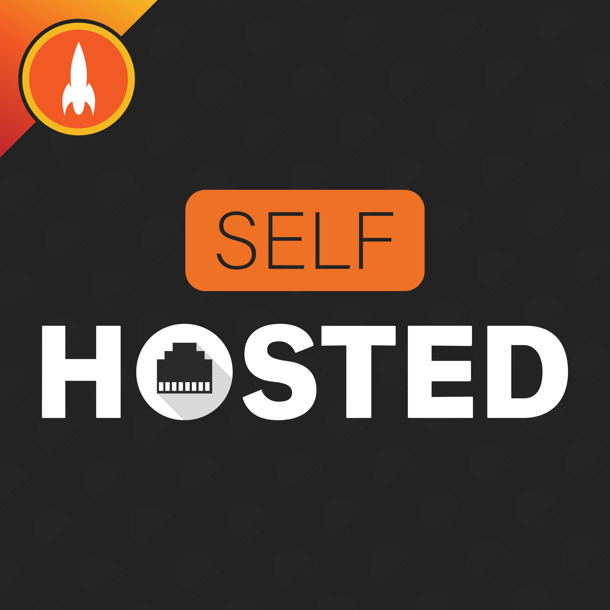
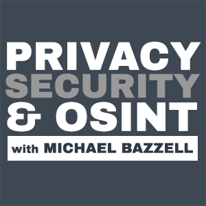
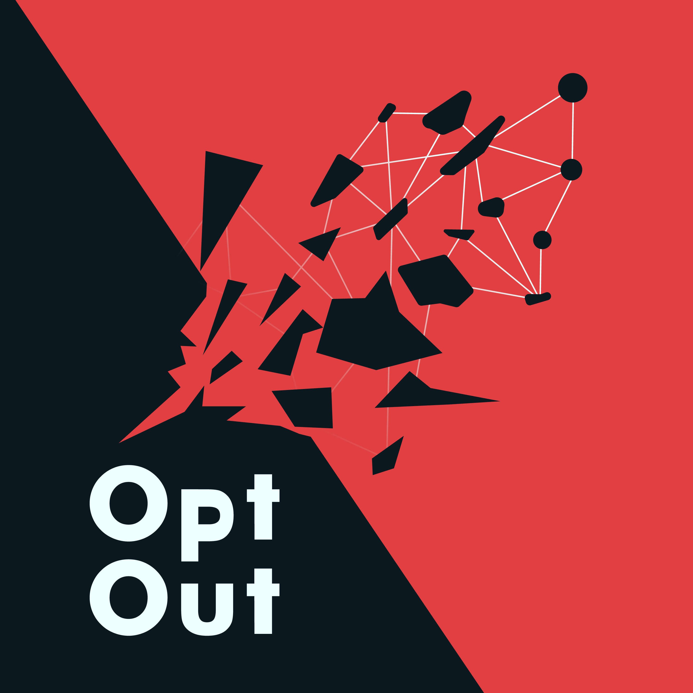

## What is Data Self Sovereignty?
In the simplest of terms, it means that the individual has complete control of any data they create in a digital space. Is it possible to have complete sovereignty over your data? No, but individuals can control aspects of self data sovereignty and make informed decisions surrounding the trade-offs between convenience and privacy/security.

Want to learn more about self data sovereignty, privacy and security? Explore the wiki and check out some of the recommendations below:

### Podcasts and Blogs
{ width="150", align="left"}
!!! note "From the [Website](https://selfhosted.show/)"
    Discover new software and hardware to get the best out of your network, control smart devices, and secure your data on cloud services. Self-Hosted is a chat show between Chris and Alex two long-time "self-hosters" who share their lessons and take you along for the journey as they learn new ones.

{ width="150", align="left"}
!!! note "From the [Website](https://inteltechniques.com/podcast.html)"
    This weekly podcast presents ideas to help you become digitally invisible, stay secure from cyber threats, and make you a better online investigator.   

{ width="150", align="left" }
!!! note "From the [Website](https://optoutpod.com/)"
    Opt Out is a podcast where I sit down with passionate people to learn why privacy matters to them, the tools and techniques they’ve found and leveraged, and where we encourage and inspire others towards personal privacy and data-sovereignty.

### Articles and Books  

