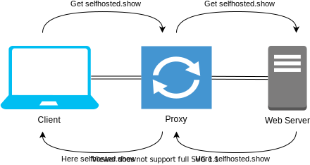
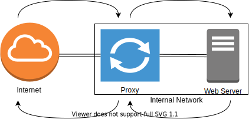
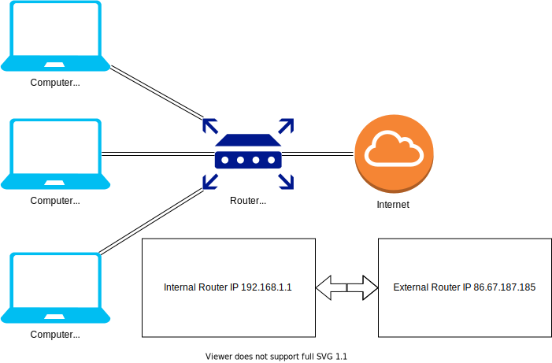

# Self Hosting Terminology Overview

## Overview
This Overview will cover common topics encountered when starting with self hosting. This overview is **not** all inclusive and should be viewed as a starting place.

### Modem (a [portmanteau](https://en.wikipedia.org/wiki/Portmanteau) of "modulator-demodulator")
A Modem converts data into different formats, used for various transmission mediums (coaxial to ethernet for example).
When a different transmission mediums are used a modem is needed in order to translate from one medium to the other. 

### Router
A router forwards and receives (routes) data (packets) to and from networks. Routers are normally located at the edge of a network as most networks use them to Network Address Translation (NAT) the Internet Protocol (IP) addresses.
Some home "modems" will combined multiple functions in to one device including routing, switching and wireless connectivity.

### Switch
A switch connects multiple devices together using physical cables, in home or office this is done using ethernet cables. Switches come in different sizes for ever use case, the most *common* sizes are 4/8/12/16/24/48 ports. They also operate at different transmission speeds, the standard (what you will find in most homes and in most computers/servers) speed right now is 1 gigabit.

### Proxy
A proxy acts as an intermediary for requests from clients to servers normally used for web requests to the internet. Requesting data in this manner will mask the clients from server, the server will only see the IP address of the proxy. 

### Reverse Proxy
A reverse proxy is used to protect a server on an internal network from outside connections. 
The simplest way to think about the differences between a proxy and reverse proxy, is a proxy protects clients and a reverse proxy protects a servers.

### Firewall
A Firewall monitors inbound and outbound traffic from a network based on a rules. A Firewall acts like a barrier between a trusted internal network and an external network like the internet.

### Internet Service Providers (ISP)
A Internet Service Providers is a company that provides access to the internet for a fee. An example of an ISP is [Verizon](https://www.verizon.com/home/highspeedinternet/) or [AT&amp;T](https://www.att.com/internet/) but there are many others.

### Ethernet
Ethernet is a "family" of technologies used in networks.
The ethernet standard separates its "family's" in to category's, The current "standard" is category 6 (CAT 6).
CAT 6 has a transmission speed of 1 Gbps and is backwards compatible with CAT5 that has a speed of 10/100 Mbps. 
The next generation is the CAT 7 standard witch has a transmission speed of 10 Gbps and is backwards compatible with CAT5/6, but most homes don't have devices that can support 10 Gbps so buying a CAT 7 is unnecessary (also see overkill) for most home users.

### Registered Jack (RJ) 45
RJ45 is a standardized telecommunication connection interface for data and voice (used in Voice over IP (VOIP) phones used in most company's). 
RJ45 is commonly used with CAT5/6/7 cables, another example of an RJ cable is RJ11 also known as an analog cable or 2 wire.

### Power Over Ethernet (POE)
PoE allows one CAT6/7 cable to power a device with out the need for a separate power brick. 
PoE has 2 standards, the minimum power that PoE can supply is 12.95 watts and PoE+ that can supply 25.5 watts per port. This can be important when verifying that the a switch can supply the power to a device. Devices that normally take advance of PoE are VOIP phones, Wireless Access points and IP cameras.

### Network Interface Controller (NIC)
A NIC is a physical card (or it can be part of the motherboard) that allows a computer to connect to a network, the NIC could provide a connection for ethernet, coaxial, fiber or wireless. 

### Media Access Control (MAC) Address
A MAC address is a unique identifer, and are "burned-in address" to the NIC. 
MAC address are used to get IP addresses when connecting to a network. 
An example of a MAC address is *00:A0:C9:14:C8:29*.

### Internet Protocol Version 4 (IPv4) addresses
IP addresses is probably one of the largest topics on this list there are 100s of [books](https://duckduckgo.com/?q=books+ip+address&t=h_&ia=shopping&iax=shopping) on the subject but we are going to stick to the basics.
An IP address is a numerical label (IE some numbers in a specific format) that is assigned to each device that connects to a network.
IP address work on a principal of private address (local internal network) and public address (external network IE the internet).

#### IP Address Classes
IP address are broken down in to different "classes", each class supports a different amount of networks and IPs, some have different uses like internal vs external IPs, there are lots of sites that will tell you what your [External IP](http://ifconfig.me/ip) is.

| **Class** | **Address range** | **Number of possible addresses and networks** |
| :-------------: | :----------: | :-----------: |
| Class A | 1.0.0.1 - 126.255.255.254 | 16 million hosts on each of 127 networks |
| Class B | 128.1.0.1 - 191.255.255.254 | 65,000 hosts on each of 16,000 networks |
| Class C | 192.0.1.1 - 223.255.254.254 | 254 hosts on each of 2 million networks |
| Class D | 192.0.1.1 - 223.255.254.254 | Reserved for multicast groups |
| Class E | 240.0.0.0 - 254.255.255.254 | Reserved for future use, or research and development purposes |

#### Private Addresses (Internal)
A private address will be anything on your local home network finding your private address is not hard if you know where to [look](https://lifehacker.com/how-to-find-your-local-and-external-ip-address-5833108).

The table shows the list of *reserved* IPv4 space that is only used on internal networks, most home networks are going to have 192.168.1.1 address, using a 192.168.1.X address will allow for a total of 254 usable IP addresses (192.168.1.1-198.168.1.254). Per the table above the 192.168.1.1 address is a class C.

| **IP address block** | **Address range** | **Number of possible addresses** |
| :-------------: | :----------: | :-----------: |
| 10.0.0.0/8 | 10.0.0.0 – 10.255.255.255 | 16,777,216 |
| 172.16.0.0/12  | 172.16.0.0 – 172.31.255.255 | 10,48,576 |
| 192.168.0.0/16 | 192.168.0.0 – 192.168.255.255 | 65,536 |

#### Dynamic vs Static IP
Dynamic IPs address are one of the ways IPs get "assigned" on network and can be external or internal, this is done automatically when new devices are plugged in to the network. IP address are given out (or set statically) using a network protocol called Dynamic Host Configuration protocol (DHCP).

##### Dynamic IP
In home networks your external IP is going to be dynamic, meaning that it can change ether when the modem is restarted or when the "lease" time the ISP uses has expired. Depending on how you want to set your (self hosted) network up you may not want the IP address to change, knowing what that address is allows you to use it to "find" your home network on the internet.

Using dynamic IPs on your home network is the "default". at home you have control of what is Dynamic and what is static, normally a modem or router is controlling the DHCP for the network.

##### Static IP
The ISP controls the external IP on the modem so in order to set it statically a fee will need to be paid to the ISP in order to do so.

At home a static IP is set by "mapping" the MAC address of the device to a chosen IP address using DHCP. Static IPs also allow for IP management, you can set range for example 192.168.1.10-192.168.1.12 that could be used for network printers and then when you add the printers to computers the IPs are static so the devices will always be able to find each other on the network.

### Port
A port is a communication endpoint at the software level within an operating system (OS), its a logical construct that identifies a specific protocol or network service. A port will always associated to an IP for example if you are running a local Secure Shell (SSH) in order to access the SSH server "192.168.1.2:22" (IP:port) would be typed in to the preferred SSH client. Ports range from 0 to 65,535, out of the 65,536 ports there is a list of ["well known ports"](https://en.wikipedia.org/wiki/Port_(computer_networking)#Common_port_numbers) that are "reserved" for that particular service.

### Subnetwork (subnet)
A subnet is a logical subdivision of an IP network. When a network is divided into two or more networks its called subnetting.

### Network Address Translation (NAT)
NAT is a method of remapping one IP address to another, this is used to "covert" external IPs to internal IPs and vice versa, when traversing the internet.
The technique was originally used to avoid the need to give a new address to every host when a network was move, or if the ISP was replaced. Using a NATed address can also help with [IPv4 exhaustion](https://www.apnic.net/community/ipv4-exhaustion/ipv4-exhaustion-details/). NATing is normally done ether at the modem, router or firewall.

### Dynamic Host Configuration protocol (DHCP)
DHCP is a management protocol used in IP networks, DHCP (dynamically) assigns IP address to any IP device on a network. [DHCP options](https://www.iana.org/assignments/bootp-dhcp-parameters/bootp-dhcp-parameters.xhtml) can be used to assign numerous other things, for example subnets, gateways, domain name server (DNS) and network time protocol (NTP) to name a few. DHCP can be hosted on ether a modem,router,server or switch depending on the use case.

### Domain Name Server (DNS)
DNS is a hierarchical and decentralized naming system for web pages, that is used on the internet and internal networks. DNS will take a website like [Google](https://google.com) and map the domain name google.com to an IP address or in Google's case (and other large organizations) lots of IPs. if you type "172.217.15.110 in to your browser you will get redirected to google.com. DNS in its most basic form is like the [yellow pages](https://en.wikipedia.org/wiki/Yellow_pages) for the internet. 

### Dynamic Domain Name Server (DDNS) 
DDNS allows for automatically updating of traditional DNS records without manual editing. This is useful for self hosting becurse without paying for a static address "mapping" a domain to an IP AND having it automatically update would be a manual process.

### Broadcast Domain
A broadcast domain is a logical separation of a network, all nodes on a broadcast domain can reach each other.

### Virtual Local Area Network (VLAN)
A VLAN is a broadcast domain that is partitioned in to smaller networks, but the networks are unable to communicate with one another. they are physically connected to the same switch, thus removing the need more for multiple cables. VLANs work by applying tags to network frames that to humans are just numbers for example you could have VLANs 10,20,30,40,50 or 2,3,4,5,6 all based on how the network is configured.

### Internet Protocol Version 6 (IPv6) addresses
IPv6 is the latest version of the internet protocol, IPv6 reuses a lot of the concepts from IPv4 but many are updated and work differently than they did before.  IPv6 was created in order to deal with a long-anticipated problem of IPv4 address exhaustion, even using NAT we have run out of "blocks" of IPv4 address that are given out to ISP ect.  Most company's and ISPs are configuring there networks for IPv6 "dual stack" mode, this allows every network device to have an IPv4 and IPv6 address so that data weather its IPv4 or 6 can be process simultaneously.

### Secure Shell (SSH)
SSH is a cryptographic network protocol (its encrypted), it allows the creation of SSH tunnels in order to configure remote services (servers) over an unsecured network. 

### Hostname
A hostname is a "label" that is assigned to a device on a network in order to uniquely identify. For example a hostname of a device on a network could be "saturn".

### Domain
A domain name is a identification system, used on networks and the internet. and its used to define an "area" of administrative control on any network.For example a domain name of a network could be "solarsystem" that would represent all devices on that network as they would all be on the same domain.

### Fully Qualified Domain Name (FQDN)
A FQDN includes both the hostname and the domain name. Thus identifying not just a system name that could be on any domain on the planet but a specific device on a specific domain for example "saturn.solarsystem.com"

### Wireless Access point (WAP)
A WAP or just access point (AP) is a networking device that allows other Wi-Fi devices to connect to to a wired network. A WAP could be built in to a router or it can be a standalone.

### Local Area Network (LAN)
A LAN is a generic term that references a network with in a limited area like a home, school, office.

### Wide Area Network (WAN)
A WAN is a generic term that references network that extends over a large geographical area like an ISP.

### Hard Disk Drive (HDD)
A HDD is a electro-mechanical storage device that uses magnetic storage to store and retrieve data using a rapidly rotation platters. HDDs come in two primarily sizes 2.5 and 3.5-inch. 

### Solid State Drive (SSD)
A SSD uses integrated circuits to store data, typically using flash memory just like a USB flash drive.

### Network Attached Storage (NAS)
A NAS is a purpose built appliance for storing and sharing data. Depending on the NAS 2.5 HDD or SSD and 2.5 HDD or SSD are supported depending on the type of data that needs to be stored, and the amount of money thats going to be spent. The main advantage when using a NAS is being able to share data with multiple devices at the same time.

### Hypervisor
A hypervisor is software that creates and runs virtual machines, on top of the same hardware. some examples are Microsoft Hyper-V, Xbox One System Software, VMware ESXi and Xen.

### Operation system level virtualization or Containers
A container is an isolated application that runs on top of a shared kernel normally with other containers. Containers inherently work different than a virtual machines and there for have some different use cases. For example running a development environment for a website might be a good use for a container. 

__Note__: **The diagrams in this article were made with [Draw.Io](https://app.diagrams.net/).**

## Recommended Reading

* [What is DNS](https://www.cloudflare.com/learning/dns/what-is-dns/)
* [How DNS Works](https://www.verisign.com/en_US/website-presence/online/how-dns-works/index.xhtml)
* [Whats My External IP?](https://bgp.he.net/)
* [IPv4 Exhaustion](https://www.apnic.net/community/ipv4-exhaustion/ipv4-exhaustion-details/)
* [IPv4 vs IPv6](https://www.guru99.com/difference-ipv4-vs-ipv6.html)
* [What is IPv6 Dual Stack](https://whatismyipaddress.com/dual-stack)
* [Differences Between CAT5/6/7 Cables](https://www.pcgamer.com/what-are-the-differences-between-cat5-cat6-and-cat7-ethernet-cables/)
* [What is a Hypervisor](https://www.vmware.com/topics/glossary/content/hypervisor)
* [What is a Container](https://www.docker.com/resources/what-container)
* [How to Subnet](http://mcsalearning.blogspot.com/2017/04/subnetting-a-tcp-ip-network-using-the-magic-box-method.html) 
* [VMs vs Containers](https://www.backblaze.com/blog/vm-vs-containers/)
* [what is a container](https://www.docker.com/resources/what-container)