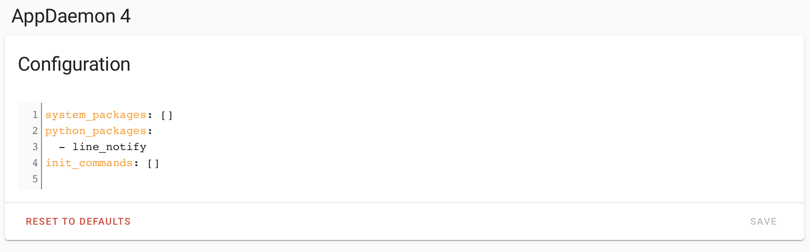

## The challenge
Living in Japan we generally default to using [LINE](https://mobile.line.me) for our messaging needs. At the time of this writing there is no integration for LINE within [Home Assistant](https://www.home-assistant.io). Currently I use [PushOver](https://pushover.net) for some of my Home Assistant notifications. I also use [Zapier](https://zapier.com) with email to trigger notifications to my family LINE group. You can see how I did this [here](https://dev.to/basman/integrating-line-message-and-zapier-58e6) and [here](https://gmailzapierlinenotify.readthedocs.io/en/latest/).

I also track some [Tile](https://www.thetileapp.com/) devices to know when family members are home. And of course I want to keep an eye on the younger members. Know when they leave home, get home and such. I want my wife and myself to get these notifications.

Since we already have a LINE group for other notifications. I thought it would be good to just add these to the existing group, and avoid paying for, and installing additional software on to my wife's phone.

I have previously used [line_notify](https://pypi.org/project/line_notify/) from [pypyi.org](https://pypi.org/)  to send some notifications using Python.

But getting this Python module directly connected with Home Assistant is not possible.

## The solution

- [AppDaemon](https://appdaemon.readthedocs.io/en/latest/)
- [line_notify](https://pypi.org/project/line_notify/)

Following some research I found AppDaemon might meet my needs. AppDaemon is a sandboxed python environment that can be integrated with Home Assistant and has access to entity state and can monitor events within Home Assistant. It also allows you to import external Python modules. Yay. I can use line_notify.

### How I got it done

1. Install AppDaemon. This will vary based on your setup. There is plenty of documentation on this.
2. Add line_notify to the Python modules list in AppDaemon's configuration pane.

3. Generate your Line Bot Token. See my previous [article](https://dev.to/basman/integrating-line-message-and-zapier-58e6) or [Read the Docs](https://gmailzapierlinenotify.readthedocs.io/en/latest/). Remember to store it somewhere safe.
4. Create your new AppDaemon app.

#### Creating the App
The coding will be done in your Home Assistant's **appdaemon** folder located under your **config** folder. If you need a visual guide. I would direct you to the YouTube link below.

First let's make sure you have your timezone and location information setup correctly. Locate and open your **appdaemon.yaml** file. In my case my timezone is *Asia/Tokyo*

```yaml
---
secrets: /config/secrets.yaml
appdaemon:
  latitude: XX
  longitude: YY
  elevation: 0
  time_zone: Asia/Tokyo
  plugins:
    HASS:
      type: hass
      ha_url: http://192.168.X.X:8123
      token: !secret appdaemon
      app_init_delay: 20
http:
  url: http://127.0.0.1:5050
admin:
api:
hadashboard:
```
!!! note
    Latitude and Longitude could be referenced from your **secrets.yaml** file and actually, they should be.  
    Having an incorrect timezone setting may result in unexpected behaviour.

Next open **apps.yaml** in the **apps** folder.
Assuming this a fresh setup, there should just be the hello_world app. So we will be adding a new app below it.
```yaml
---
hello_world:
  module: hello
  class: HelloWorld
line_notify:
  module: line_message
  class: LineMessage
```
1. line_notify -> App Name
2. line_message -> module name. file will be named *line_message.py*
3. LineMessage -> Class name used within *line_message.py*

Next copy hello.py to make a new file.
```
cp hello.py line_message.py
```
Open the new file and add the following code.
```Python
import appdaemon.plugins.hass.hassapi as hass
from line_notify import LineNotify

LINE_TOKEN="LINE BOT TOKEN GENERATED PREVIOUSLY"

class LineMessage(hass.Hass):

  def initialize(self):
     self.log("Starting Line Message Service.")
     self.listen_state(self.person1_home_send, "device_tracker.person1", new = "home")
     self.listen_state(self.person1_away_send, "device_tracker.person1", new = "not_home")

  def person1_home_send(self, entity, attribute, old, new, kwargs):
      if self.now_is_between("07:50:00", "21:00:00"):
        self.send_message("Person1 has arrived Home.")
  def person1_away_send(self, entity, attribute, old, new, kwargs):
      if self.now_is_between("07:50:00", "20:00:00"):
        self.send_message("Person1 has left Home.")

  def send_message(self, message):
      self.log(f"Sending message {message}")
      notify = LineNotify(LINE_TOKEN)
      notify.send(message)
      self.log("Finished sending message")
```

#### What does this code do
- Unfortunately the Token needs to be hardcoded. From my reading there is currently no way around this.
- initialize.
   - This  method is **required**. If is missing nothing will happen. In this case we are saying the following.
   1. When device_tracker.person1 changes to *home* call the method named *person1_home_send*
   2. When device_tracker.person1 changes to *not_home* call the method named *person1_away_send*
- person1_home_send
  - If this event takes place between 7:50am and 9pm call the *send_message* method with the argument provided.
- person1_away_send
  - If this event takes place between 7:50am and 8pm call the *send_message* method with the argument provided.
- send_message
  - This takes the message string as input. Creates the notify object needed to send the message to LINE and then sends it.

This completes the coding of the app. Go back to Home Assistant and restart the AppDaemon.

This code can easily be expanded for more use cases.

## References
- YouTube: [here](https://www.youtube.com/watch?v=GVIS7GtqLpo)
- [Line Notify Bot](https://notify-bot.line.me/en/)
- [Line Notify Bot Documentation](https://notify-bot.line.me/doc/en/)
