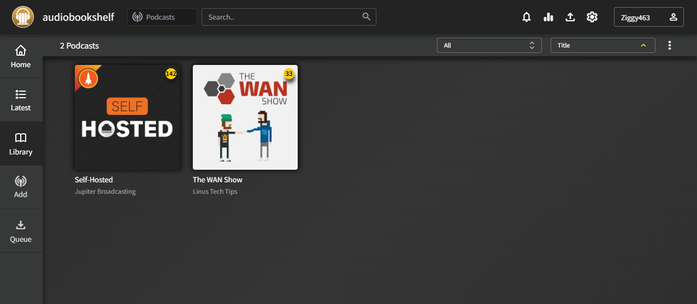

# Audiobookshelf

!!!attention "Make sure to read the official docs"
    This guide will be focusing on using docker compose.

    View Audiobookshelf's offical documentation [here](https://www.audiobookshelf.org/docs) for
    alternative installation methods.

## What is Audiobookshelf?

Audiobookshelf is an open-source self-hosted media server for your audiobooks and podcasts.



## Features

- Companion android and iOS app w/ offline listening (in beta)
- Multi-user support w/ custom permissions
- Keeps progress per user and syncs across devices
- Lookup and apply metadata and cover art from several providers
- Audiobook chapter editor w/ chapter lookup
- Audiobook tools: Embed metadata in audio files & merge multiple audio files to a single m4b
- Search and add podcasts to download episodes w/ auto-download
- Open RSS feeds for audiobooks and podcast episodes
- Backups with automated backup scheduling
- Basic ebook support and ereader (epub, pdf, cbr, cbz) + send to device (i.e. Kindle)
- And much more...

## Requirements

- [Docker](https://docs.docker.com/engine/install/)
- [Docker-compose](https://docs.docker.com/compose/install/)

## Getting Started

Here is an example docker-compose.yml to start with. 

```
services:
  audiobookshelf:
    # If you want to use a specific version, replace "latest" with the version you want.
    # Example: ghcr.io/advplyr/audiobookshelf:2.18.0
    image: ghcr.io/advplyr/audiobookshelf:latest
    ports:
      - 13378:80
    volumes:
    # Remember to change the path to your actual directory and remove the <> symbols.
      - </path/to/audiobooks>:/audiobooks
      - </path/to/podcasts>:/podcasts
      - </path/to/config>:/config
      - </path/to/metadata>:/metadata
    environment:
      - TZ=America/Toronto
```

## Start Your Container!
Once your docker-compose.yml is configured to you liking. You can run the command below to start the container.

```
docker compose up -d
```

Congrats! You can now access your Audiobookshelf instance at <http://localhost:13378>

## Updating

To update your Audiobookshelf instance, it's as easy as running the following commands.

```
docker compose pull
docker compose down
docker compose up -d
```